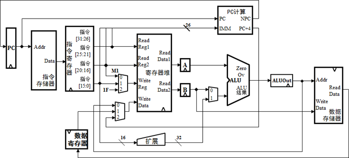

## 一个简单的单周期mipsCPU

本项目使用Verilog语言模拟了一个简单的单周期mips指令集CPU。完成了MiniSys的全部31条指令（add、addi、addu、addiu、sub、subu、and、or、xor、lui、nor、slt、sltu、slti、sltiu、ori、sll、srl、sra、beq、bne、addi、addiu、andi、ori、xori、lui、lw、sw、beq、bne、slti、sltiu、j、jal），配有相应的测试汇编代码，对每一条指令进行了测试。

### 总体数据通路

在本次设计的CPU中，指令和数据各存储在不同存储器中，即有指令存储器和数据存储器。访问存储器时，先给出地址，然后由读/写信号控制(1-写, 0-读)。对于寄存器组，读操作时，先给出地址，输出端就直接输出相应数据;而在写操作时，在WE使能信号为1时，在时钟边沿触发写入。下图是本CPU的数据通路和必要的控制线路图。

### 模块设计

已经实现的模块：

- PC：完成输出当前指令地址并保存下一条指令地址。
- NPC：用于更新 PC，根据控制信号的不同分别执行不同的策略，如+4、分支等
- IM：是CPU中的指令寄存器，用来存放需要执行的指令。
- CTRL：控制模块，对输入的信号进行判断，用来产生对应的控制指令。
- GPR：寄存器模块，用来模拟MIPS指令集中所定义的32个通用寄存器。
- MUX：数据选择器模块，功能是实现根据控制信号的不同输出不同接口上的数据。
- ALU：算术运算模块，功能是进行逻辑或算术运算，通过接受寄存器的数据信号以及控制单元的控制信号来决定该模块所执行的运算。
- DM：数据存储器模块，用来存放运算所需的数据和运算结果。

模块具体的接口在代码文件里都有注释，在此不再赘述。

### 开源协议

基于MIT协议开源